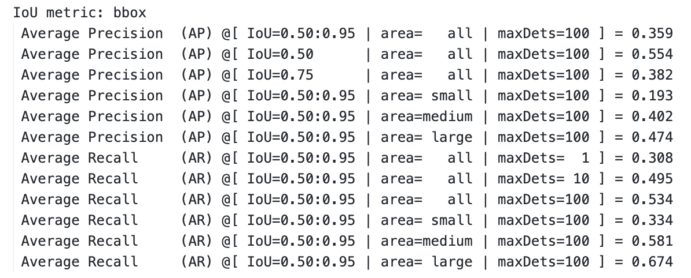

# INU_RISE

* This repository is dedicated to researching and developing efficient techniques for the object detection task.

 

## Plan & Description of the Project
- [X] The key papers that have influenced the topic selection are as follows.
   * [He, Kaiming, et al. "Deep residual learning for image recognition." Proceedings of the IEEE conference on computer vision and pattern recognition. 2016.](https://arxiv.org/abs/1512.03385)
   * [Lin, Tsung-Yi, et al. "Feature pyramid networks for object detection." Proceedings of the IEEE conference on computer vision and pattern recognition. 2017.](https://arxiv.org/abs/1612.03144)
   * [Lin, Tsung-Yi, et al. "Focal loss for dense object detection." Proceedings of the IEEE international conference on computer vision. 2017.](https://arxiv.org/abs/1708.02002)
   * [Kang, Woochul. "Adaptive Depth Networks with Skippable Sub-Paths." arXiv preprint arXiv:2312.16392 (2023).](https://arxiv.org/abs/2312.16392)

- [X] **`01_pytorch_references_retinanet/`** : 
 I will use **RetinaNet for base** detector, which has good accessibility for research and development.
 ([PyTorch provides the reference model RetinaNet for research purposes](https://github.com/pytorch/vision/blob/main/torchvision/models/detection/retinanet.py), making code management easy and convenient.)
   * `./custom_eval_from_train/eval_log.txt` :  
   A result of pytorch reference model(resnet50_fpn_retinanet) trained on COCO dataset.
   

 

- [ ] **`02_backbone_with_adaptivedepth_retinanet/`** : <
 We will evaluate the performance by **applying the adaptive depth network to the RetinaNet backbone network**, which is resnet50_fpn.
* Things to develop and modify.
   * Train the backbone network (ResNet50-FPN) using skip-aware self-distillation.
   * switchable BNs
   * Add a skip argument to the forward function of the evaluation.
   * Modify the lateral path of the FPN appropriately for the skipped network.

 

- [ ] 
**`03_?(Not yet planned)?/` :** 
Developing a new technique to improve performance while reducing the size of the RetinaNet model, achieving either the same performance with increased speed or a slight decrease in speed with performance enhancement.